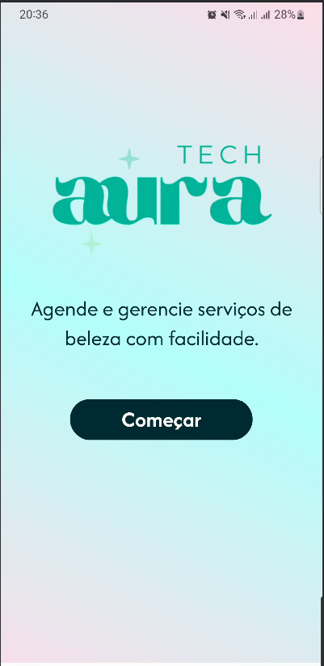
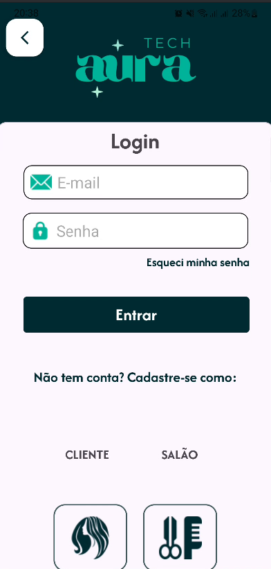
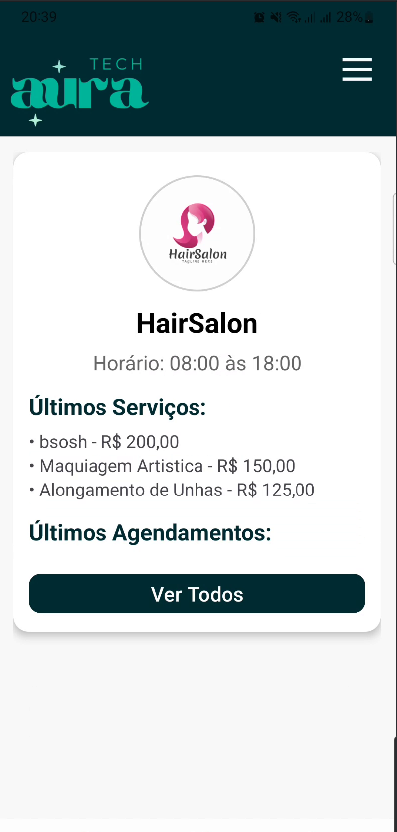
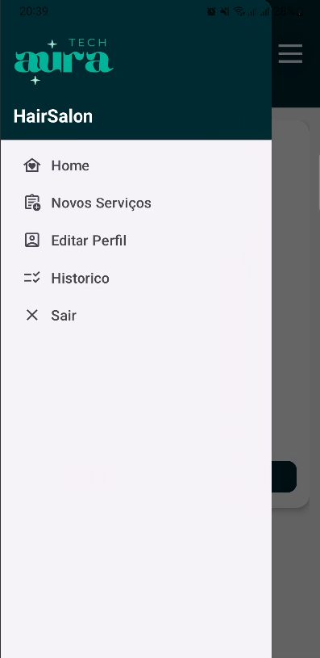
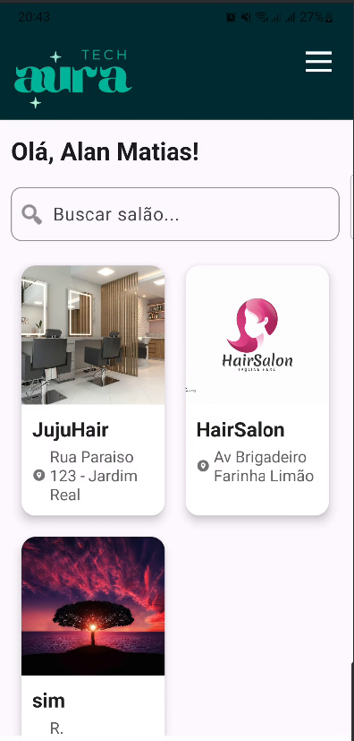
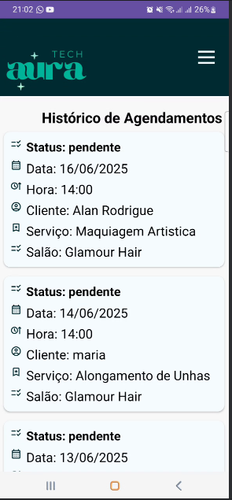
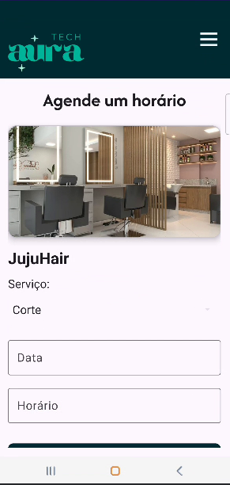

# 💇‍♀️ Aura TECH - App de Agendamentos para Salões de Beleza

[](https://kotlinlang.org/)
[](https://developer.android.com/studio)
[](https://firebase.google.com/)
[](LICENSE)

> Aplicativo mobile para facilitar o agendamento de serviços entre clientes e salões de beleza.

---

## ✨ Visão Geral

O **Aura TECH** é um aplicativo desenvolvido em **Kotlin com Android Studio**, voltado para o agendamento de serviços em salões de beleza. Ele permite que:

- Clientes encontrem salões e agendem horários disponíveis para serviços como corte de cabelo, manicure etc.
- Salões gerenciem sua agenda e personalizem seus horários e serviços.

---

## 📋 Regras de Negócio

- **RN01:** Cada usuário é identificado como *Cliente* ou *Salão*, com funcionalidades específicas.
- **RN02:** Salões definem horários de funcionamento e serviços oferecidos.
- **RN03:** Clientes só podem agendar horários disponíveis, sem conflitos.
- **RN04:** Histórico de agendamentos é mantido por 3 meses.

---

## ✅ Funcionalidades

### Para Clientes:
- Criar conta e login via **Firebase Auth**
- Listar salões disponíveis
- Visualizar serviços e horários livres
- Agendar serviços
- Consultar histórico de agendamentos

### Para Salões:
- Criar conta e login via **Firebase Auth**
- Cadastrar serviços oferecidos
- Definir horários de funcionamento
- Gerenciar agendamentos recebidos
- Visualizar histórico de até 3 meses

---

## 🛠️ Tecnologias Utilizadas

- **Frontend Mobile**: Kotlin + Android Studio
- **Arquitetura**: MVVM (Model-View-ViewModel)
- **Backend/Serviços**: Firebase
  - **Firebase Authentication**: login e controle de sessões
  - **Firebase Firestore**: banco de dados em nuvem para agendamentos, usuários e serviços

---

## ▶️ Como Executar

1. Clone o projeto:
   ```bash
   git clone https://github.com/SeuUsuario/reserva-salao.git
   ```
2. Abra com o **Android Studio**
3. Configure a conexão com o Firebase:
   - Adicione seu arquivo `google-services.json`
   - Ative **Authentication** e **Firestore**
4. Execute em um emulador ou dispositivo físico

---

## 🔒 Requisitos de Configuração (Firebase)

- Habilitar o **Firebase Auth** com email/senha
- Criar regras de segurança no **Firestore**, exemplo:
```js
rules_version = '2';
service cloud.firestore {
  match /databases/{database}/documents {
    match /{document=**} {
      allow read, write: if request.auth != null;
    }
  }
}
```

---

## 👥 Equipe

- **Alan Matias** – Desenvolvedor FullStack,Planejamento e Suporte
- **Ana Beatriz** – Desenvolvedor BackEnd, Integração e Lógica
- **Maria Eduarda** – Desenvolvedor BackEnd, Validação e Banco de Dados
- **Julia Lopes** – Desenvolvedor FrontEnd, Design e Definição de Telas

---

## 📄 Licença

Distribuído sob a licença MIT. Veja `LICENSE` para mais detalhes.

---

## 🧪 Possíveis Expansões Futuras

- Notificações push para lembretes de agendamento
- Pagamento digital via Pix ou cartão
- Avaliação de serviços e salões

---

## 📸 Capturas de Tela










---

Feito com 💜 por alunos da FATEC – 2025
